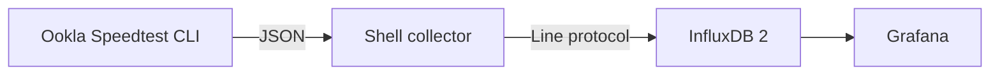

# Ookla Speedtest to InfluxDB

[Português (Brasil)](docs/README.pt-BR.md)

A small, headless collector that runs the official Ookla Speedtest CLI and
writes the results directly to InfluxDB 2. It has no web interface, embedded
database, or application runtime: the collector is a POSIX shell script using
`jq` and `curl`.



## Highlights

- Official Ookla Speedtest CLI
- Native InfluxDB 2 token authentication
- Optional fixed Ookla server ID
- Configurable test interval, timeout, and retries
- Human-readable structured logs
- `RUN_ONCE` mode for testing and external schedulers
- Published multi-architecture image for AMD64 and ARM64
- No Python runtime and no application dependencies

## Quick start

Review the [Ookla EULA](https://www.speedtest.net/about/eula), Terms of Use,
and Privacy Policy before continuing. Ookla permits its CLI for personal,
non-commercial use. This project does not distribute the proprietary CLI in
its container image. After explicit acceptance, the container downloads it
from Ookla's official Packagecloud repository on first startup.

Clone the repository and create your local configuration:

```bash
git clone https://github.com/Adrianozk/ookla-speedtest-influxdb.git
cd ookla-speedtest-influxdb
cp .env.example .env
```

Edit `.env`:

```env
TZ=UTC
OOKLA_EULA_ACCEPTED=true
INFLUX_URL=http://influxdb:8086
INFLUX_ORG=my-organization
INFLUX_BUCKET=speedtests
INFLUX_TOKEN=replace-with-a-write-token
SPEEDTEST_SERVER_ID=30306
SPEEDTEST_INTERVAL=3600
HOST_TAG=home-server
```

Start the collector:

```bash
docker compose up -d
docker compose logs -f speedtest-influxdb
```

The first container creation takes longer because the official CLI is fetched
from Ookla. Normal container restarts reuse the installed CLI; recreating the
container installs it again.

## Configuration

| Variable | Required | Default | Description |
|---|---:|---:|---|
| `OOKLA_EULA_ACCEPTED` | yes | `false` | Must be explicitly set to `true` after reviewing Ookla's terms |
| `INFLUX_URL` | yes | — | Base URL of the InfluxDB 2 instance |
| `INFLUX_ORG` | yes | — | InfluxDB organization name |
| `INFLUX_BUCKET` | yes | — | Destination bucket |
| `INFLUX_TOKEN` | yes | — | Token with write access to the bucket |
| `SPEEDTEST_SERVER_ID` | no | automatic | Ookla server ID to pin for comparable results |
| `SPEEDTEST_INTERVAL` | no | `3600` | Seconds between successful tests |
| `SPEEDTEST_FAIL_INTERVAL` | no | `300` | Seconds before another test after failure |
| `SPEEDTEST_TIMEOUT` | no | `180` | Maximum seconds for the Ookla CLI process |
| `INFLUX_RETRIES` | no | `3` | Write attempts for each result |
| `INFLUX_RETRY_INTERVAL` | no | `10` | Seconds between write attempts |
| `HOST_TAG` | no | container hostname | Stable host identifier stored as a tag |
| `MEASUREMENT` | no | `speedtest` | InfluxDB measurement name |
| `RUN_ONCE` | no | `false` | Run one test, write it, and exit |

Use a dedicated InfluxDB token limited to write access on the destination
bucket. Do not put a real token directly in `compose.yml`.

## Server selection

Set `SPEEDTEST_SERVER_ID` to pin every test to one Ookla server. This is the
best option when consistent trend comparisons matter.

Leave `SPEEDTEST_SERVER_ID` empty, or omit it, to use automatic selection. In
this mode the collector does not pass `--server-id`; the official Ookla CLI
chooses the server for each run. Automatic selection is not uniformly random,
so the same server may be selected repeatedly.

In both modes, the server actually used is read from the CLI JSON result and
stored with every point as the `server_id`, `server_name`, `server_location`,
and `server_country` tags. This keeps results traceable and allows the Grafana
dashboard to compare servers even when automatic selection changes them.

## Data model

The collector writes one point per test to the `speedtest` measurement.

Fields:

- `download_mbps`
- `upload_mbps`
- `latency_ms`
- `jitter_ms`
- `packet_loss_pct`
- `download_bytes`
- `upload_bytes`
- `download_elapsed_ms`
- `upload_elapsed_ms`

Tags:

- `host`
- `server_id`
- `server_name`
- `server_location`
- `server_country`
- `isp`
- `interface`

External and internal IP addresses, MAC addresses, and public result URLs are
deliberately not stored.

Example Flux query:

```flux
from(bucket: "speedtests")
  |> range(start: -7d)
  |> filter(fn: (r) => r._measurement == "speedtest")
  |> filter(fn: (r) => r._field == "download_mbps" or r._field == "upload_mbps")
```

## Grafana dashboard

A ready-to-import dashboard is available at
[`grafana/dashboard.json`](grafana/dashboard.json). It targets Grafana's
dashboard schema v2 and an InfluxDB 2 data source configured to use Flux.

The dashboard includes:

- latest download, upload, latency, and packet loss
- download and upload history
- latency, jitter, and packet-loss history
- minimum, average, and maximum results grouped by Ookla server
- a table with the 100 most recent tests in the selected time range

To import it:

1. In Grafana, open **Dashboards > New > Import**.
2. Upload `grafana/dashboard.json`.
3. Select the InfluxDB data source in the **InfluxDB** dashboard variable.
4. Set **Bucket** to the value of `INFLUX_BUCKET` and **Host** to the value
   of `HOST_TAG`.

The dashboard contains no InfluxDB URL, organization, or token. Those remain
in the Grafana data-source configuration.

## Logs

```text
2026-08-31T08:00:00Z level=INFO event=collector_started host=home-server interval_seconds=3600 server_id=30306
2026-08-31T08:00:00Z level=INFO event=speedtest_started server_id=30306
2026-08-31T08:00:18Z level=INFO event=speedtest_succeeded download_mbps=500 upload_mbps=250 latency_ms=8.1 server_id=30306
2026-08-31T08:00:18Z level=INFO event=influx_write_succeeded bucket=speedtests attempt=1
```

Tokens are never included in collector logs.

## Development

Run the parser, server-selection, and write-path tests without making a real
Speedtest or InfluxDB request:

```bash
bash tests/test_collector.sh
```

Build locally:

```bash
docker build -t ookla-speedtest-influxdb .
```

## License and trademarks

The source code in this repository is licensed under the MIT License.
Speedtest, Speedtest by Ookla, and the Speedtest logo are trademarks of Ookla,
LLC. The proprietary Ookla CLI is downloaded separately and remains subject to
Ookla's own license and terms. This project is not affiliated with or endorsed
by Ookla.

## Collection status and historical logs

Each completed test now writes a separate `${MEASUREMENT}_status` point, including failures. Speed measurements remain unchanged. See the [status schema and log import guide](docs/status-history.pt-BR.md) for the safe preview/import workflow and Grafana field mapping.
