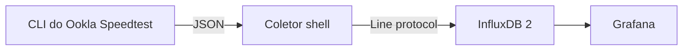

# Ookla Speedtest para InfluxDB

[English](../README.md)

Um coletor pequeno e sem interface que executa o CLI oficial do Ookla
Speedtest e grava os resultados diretamente no InfluxDB 2. Não há interface
web, banco embutido ou runtime de aplicação: o coletor é um script POSIX shell
que usa `jq` e `curl`.



## Principais características

- CLI oficial do Ookla Speedtest
- Autenticação nativa por token do InfluxDB 2
- Possibilidade de fixar o ID do servidor Ookla
- Intervalo, timeout e tentativas configuráveis
- Logs estruturados e fáceis de ler
- Modo `RUN_ONCE` para testes ou agendadores externos
- Imagem para AMD64 e ARM64
- Sem runtime Python ou dependências de aplicação

## Início rápido

Leia a [licença do Ookla](https://www.speedtest.net/about/eula), os Termos de
Uso e a Política de Privacidade antes de continuar. O Ookla permite o uso do
CLI para fins pessoais e não comerciais. Este projeto não distribui o CLI
proprietário dentro da imagem. Após o aceite explícito, o container baixa o
programa do repositório oficial do Ookla no Packagecloud durante a primeira
inicialização.

Clone o repositório e crie sua configuração local:

```bash
git clone https://github.com/Adrianozk/ookla-speedtest-influxdb.git
cd ookla-speedtest-influxdb
cp .env.example .env
```

Edite `.env`:

```env
TZ=America/Sao_Paulo
OOKLA_EULA_ACCEPTED=true
INFLUX_URL=http://influxdb:8086
INFLUX_ORG=minha-organizacao
INFLUX_BUCKET=speedtests
INFLUX_TOKEN=substitua-por-um-token-de-escrita
SPEEDTEST_SERVER_ID=30306
SPEEDTEST_INTERVAL=3600
HOST_TAG=meu-servidor
```

Inicie:

```bash
docker compose up -d
docker compose logs -f speedtest-influxdb
```

A primeira criação demora mais porque o CLI oficial é obtido do Ookla.
Reiniciar o mesmo container reutiliza o programa instalado; recriar o
container faz uma nova instalação.

## Configuração

| Variável | Obrigatória | Padrão | Descrição |
|---|---:|---:|---|
| `OOKLA_EULA_ACCEPTED` | sim | `false` | Deve ser definida como `true` após a leitura dos termos do Ookla |
| `INFLUX_URL` | sim | — | URL base da instância InfluxDB 2 |
| `INFLUX_ORG` | sim | — | Nome da organização |
| `INFLUX_BUCKET` | sim | — | Bucket de destino |
| `INFLUX_TOKEN` | sim | — | Token com permissão de escrita no bucket |
| `SPEEDTEST_SERVER_ID` | não | automático | ID do servidor Ookla a ser fixado |
| `SPEEDTEST_INTERVAL` | não | `3600` | Segundos entre testes bem-sucedidos |
| `SPEEDTEST_FAIL_INTERVAL` | não | `300` | Segundos antes de repetir após falha |
| `SPEEDTEST_TIMEOUT` | não | `180` | Limite do processo do Ookla em segundos |
| `INFLUX_RETRIES` | não | `3` | Tentativas de escrita de cada resultado |
| `INFLUX_RETRY_INTERVAL` | não | `10` | Segundos entre tentativas de escrita |
| `HOST_TAG` | não | hostname do container | Identificador estável do coletor |
| `MEASUREMENT` | não | `speedtest` | Nome da measurement no InfluxDB |
| `RUN_ONCE` | não | `false` | Executa um teste, grava e encerra |

Utilize um token dedicado, limitado à escrita no bucket escolhido. Não coloque
um token verdadeiro diretamente no arquivo Compose.

## Seleção do servidor

Defina `SPEEDTEST_SERVER_ID` para fixar todos os testes em um servidor Ookla.
Essa é a melhor opção quando a consistência da comparação histórica é mais
importante.

Deixe `SPEEDTEST_SERVER_ID` vazio, ou remova a variável, para usar a seleção
automática. Nesse modo o coletor não envia `--server-id`; o CLI oficial do
Ookla escolhe o servidor em cada execução. A seleção automática não é
uniformemente aleatória, portanto o mesmo servidor pode ser escolhido várias
vezes.

Nos dois modos, o servidor realmente utilizado é lido do JSON do CLI e salvo
em cada ponto nas tags `server_id`, `server_name`, `server_location` e
`server_country`. Assim os resultados continuam rastreáveis e o dashboard do
Grafana consegue comparar servidores mesmo quando a seleção automática muda.

## Modelo dos dados

Cada teste gera um ponto na measurement `speedtest`.

Fields:

- `download_mbps`
- `upload_mbps`
- `latency_ms`
- `jitter_ms`
- `packet_loss_pct`
- `download_bytes`
- `upload_bytes`
- `download_elapsed_ms`
- `upload_elapsed_ms`

Tags:

- `host`
- `server_id`
- `server_name`
- `server_location`
- `server_country`
- `isp`
- `interface`

IPs interno e externo, endereço MAC e URL pública do resultado não são
armazenados propositalmente.

Consulta Flux de exemplo:

```flux
from(bucket: "speedtests")
  |> range(start: -7d)
  |> filter(fn: (r) => r._measurement == "speedtest")
  |> filter(fn: (r) => r._field == "download_mbps" or r._field == "upload_mbps")
```

## Dashboard do Grafana

Um dashboard pronto para importação está disponível em
[`grafana/dashboard.json`](../grafana/dashboard.json). Ele usa o schema v2 de
dashboards do Grafana e uma fonte de dados InfluxDB 2 configurada para Flux.

O dashboard mostra:

- download, upload, latência e perda de pacotes mais recentes
- histórico de download e upload
- histórico de latência, jitter e perda de pacotes
- resultados mínimos, médios e máximos agrupados por servidor Ookla
- tabela com os 100 testes mais recentes dentro do período selecionado

Para importar:

1. No Grafana, abra **Dashboards > New > Import**.
2. Envie o arquivo `grafana/dashboard.json`.
3. Selecione a fonte InfluxDB na variável **InfluxDB** do dashboard.
4. Defina **Bucket** com o valor de `INFLUX_BUCKET` e **Host** com o valor de
   `HOST_TAG`.

O dashboard não contém URL, organização ou token do InfluxDB. Esses dados
continuam apenas na configuração da fonte de dados do Grafana.

## Logs

```text
2026-08-31T08:00:00Z level=INFO event=collector_started host=meu-servidor interval_seconds=3600 server_id=30306
2026-08-31T08:00:00Z level=INFO event=speedtest_started server_id=30306
2026-08-31T08:00:18Z level=INFO event=speedtest_succeeded download_mbps=500 upload_mbps=250 latency_ms=8.1 server_id=30306
2026-08-31T08:00:18Z level=INFO event=influx_write_succeeded bucket=speedtests attempt=1
```

O token nunca é incluído nos logs do coletor.

## Desenvolvimento

Teste o parser, a seleção de servidor e o caminho de escrita sem executar um
Speedtest real ou acessar o InfluxDB:

```bash
bash tests/test_collector.sh
```

Construa localmente:

```bash
docker build -t ookla-speedtest-influxdb .
```

## Licença e marcas

O código-fonte deste repositório usa a licença MIT. Speedtest, Speedtest by
Ookla e o logotipo Speedtest são marcas do Ookla, LLC. O CLI proprietário é
baixado separadamente e permanece sujeito à licença e aos termos do Ookla.
Este projeto não possui afiliação nem endosso do Ookla.

## Status das coletas e histórico

Cada teste concluído agora grava um ponto separado em `${MEASUREMENT}_status`, incluindo falhas. As métricas de velocidade são preservadas. Consulte o [guia de status e importação de logs](status-history.pt-BR.md) para importar o histórico e usar os novos campos no Grafana.

O [dashboard pronto para importar](../grafana/dashboard.json) agora inclui status das coletas, detalhes dos erros, idade da medição e lacunas visíveis. Configure **Max data age (seconds)** como `1200` para testes a cada 15 minutos ou `4500` para testes a cada hora. O [guia original em inglês](status-history.md) documenta o mesmo procedimento.
